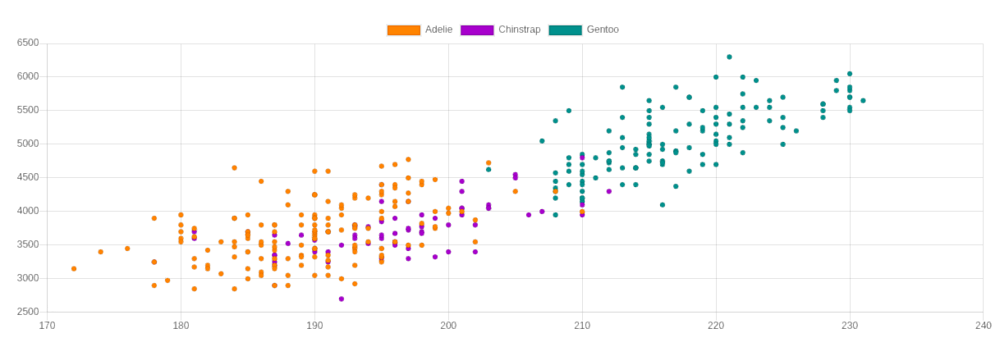

<!-- badges: start -->
<!-- badges: end -->

<div style="text-align:center;" align="center">

# charter

Chart.js for R

</div>

## Installation

You can install the package from Github

```r
# install.packages("remotes")
remotes::install_github("JohnCoene/charter")
```

## Example

``` r
library(charter)

chart(cars, caes(speed, dist)) %>% 
  c_scatter()

# remotes::install_github("allisonhorst/palmerpenguins")
data(penguins, package = 'palmerpenguins')

chart(data = penguins, caes(flipper_length_mm, body_mass_g)) %>% 
  c_scatter(caes(color = species, group = species)) %>% 
  c_colors( c("darkorange","darkorchid","darkcyan"))
```


